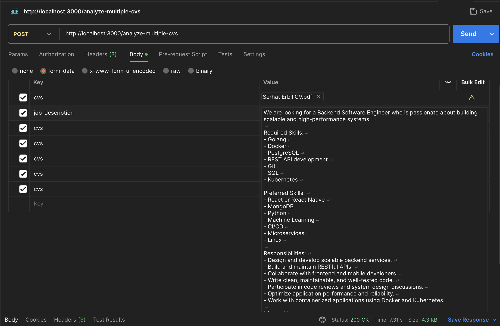
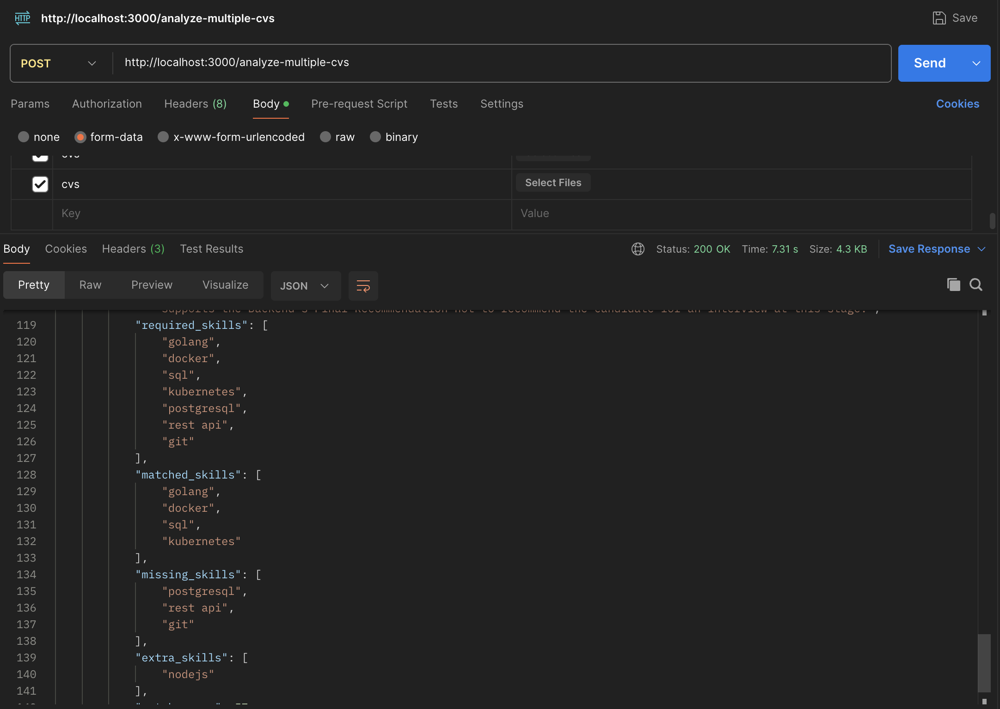
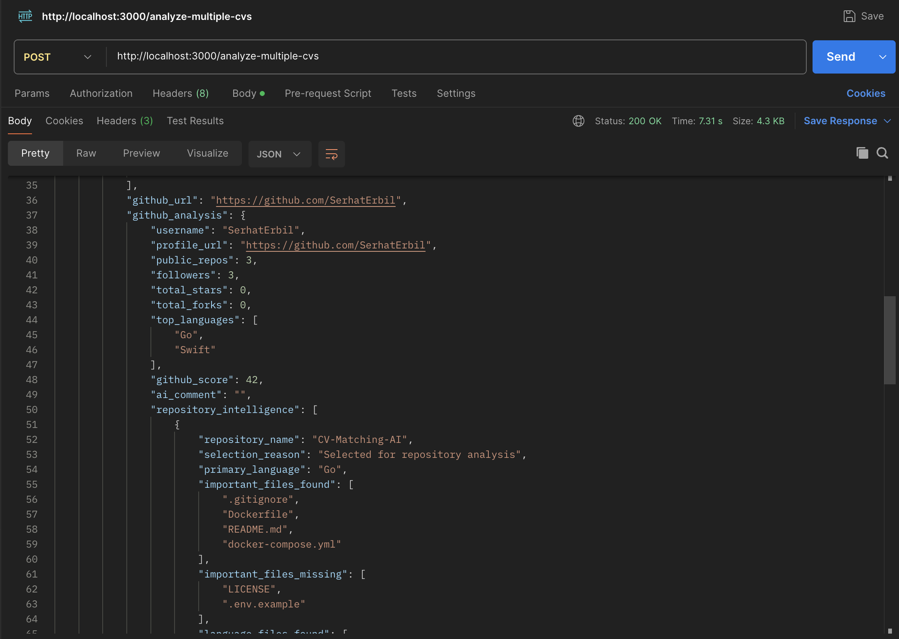
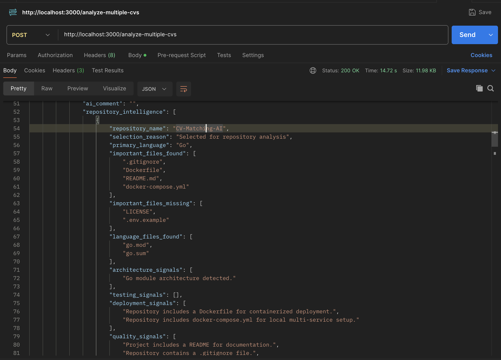

<p align="center">


</p>

# CV Matching AI

### AI-powered hiring assistant for resume analysis and GitHub evaluation.

Analyze resumes, compare multiple candidates, examine GitHub repositories, identify required and missing skills, and generate AI-powered hiring recommendations.

## 📸 Demo

### 1. API Request

Upload one or multiple resumes together with a job description using the `POST /analyze-multiple-cvs` endpoint.

<p align="center">
  
</p>


### 2. AI Analysis Result

The system extracts skills, identifies required and missing skills, calculates candidate scores, and generates AI-powered hiring recommendations.

<p align="center">
  
</p>


### 3. GitHub Repository Analysis

The application analyzes the candidate's GitHub profile, detects repository statistics, programming languages, and evaluates repository quality.

<p align="center">
  
</p>


### 4. Repository Intelligence

The system performs repository-level analysis by identifying important project files, detecting missing best-practice files, and generating repository intelligence.

<p align="center">
  
</p>

## 📖 Project Overview

Recruiting and screening candidates manually is a time-consuming process that often relies on keyword matching and subjective evaluation. Traditional resume screening tools may overlook valuable technical information, especially a candidate's GitHub projects and software engineering practices.

CV Matching AI is an AI-powered recruitment assistant designed to automate the candidate evaluation process. The system analyzes one or multiple resumes, compares them against a job description, identifies required and missing skills, evaluates GitHub repositories, combines all evaluation metrics into a final candidate score, and generates AI-powered hiring recommendations.

By combining rule-based skill analysis, GitHub repository intelligence, and Large Language Models (LLMs), the platform provides a more comprehensive and objective assessment of technical candidates while helping recruiters make faster and more informed hiring decisions.

## ✨ Features

- 📄 **Multiple Resume Analysis**  
  Analyze one or multiple resumes in a single request.

- 🎯 **Job Description Matching**  
  Compare candidate resumes against a job description to measure compatibility.

- 🛠️ **Skill Extraction**  
  Automatically extract technical skills from resumes.

- ✅ **Required & Missing Skill Detection**  
  Identify matched, missing, and additional skills for each candidate.

- 👨‍💻 **GitHub Repository Analysis**  
  Analyze GitHub profiles and repositories to evaluate technical experience.

- 📊 **Repository Intelligence**  
  Detect programming languages, project quality, and important repository files.

- 🤖 **AI-Powered Candidate Evaluation**  
  Generate detailed AI-powered assessments and hiring recommendations using LLMs.

- 🏆 **Final Candidate Scoring**  
  Combine multiple evaluation metrics into a final candidate score.

- 📑 **Candidate Comparison**  
  Compare multiple candidates and rank them based on their overall evaluation.

- 🗄️ **PostgreSQL Integration**  
  Store candidate analysis results for future access and reporting.

- 🐳 **Docker Support**  
  Run the entire application in a consistent and portable environment using Docker and Docker Compose.

- 📦 **RESTful API**  
  Expose all functionality through clean and scalable REST API endpoints.

  ## 🏗️ Architecture

```text
                  HTTP Client
                     │
                     ▼
              Fiber REST API
                     │
                     ▼
               HTTP Handlers
                     │
                     ▼
          Business Logic Layer
                     │
     ┌───────────────┼───────────────┐
     ▼               ▼               ▼
 Resume Analysis  GitHub Analysis   Llama 3.2 via Ollama
     └───────────────┼───────────────┘
                     ▼
          Final Candidate Scoring
                     │
                     ▼
           PostgreSQL Database
                     │
                     ▼
              JSON API Response
```

## 🛠️ Tech Stack

| Technology | Usage |
|----------|-------|
| **Go** | Backend development |
| **Fiber** | REST API framework |
| **PostgreSQL** | Database |
| **GORM** | ORM and database operations |
| **Llama 3.2 (3B) via Ollama** | Local AI-powered evaluation |
| **Docker** | Containerization |
| **Docker Compose** | Multi-container setup |
| **Postman** | API testing |
| **Git & GitHub** | Version control and repository hosting |

## 📂 Folder Structure

```text
CV-Matching-AI/
│
├── cmd/
│   └── server/                        
│
├── docs/
│   └── images/                        
│
├── exports/
│   └── analysis_results.csv           
│
├── internal/
│   ├── handlers/
│   │   ├── analyze_handler.go
│   │   ├── analyze_multiple_handler.go
│   │   ├── match_handler.go
│   │   ├── skills_handler.go
│   │   └── upload_handler.go
│   │
│   ├── models/
│   │   ├── cv_models.go
│   │   └── github_models.go
│   │
│   └── services/
│       ├── ai_service.go
│       ├── analyze_service.go
│       ├── analyze_multiple_service.go
│       ├── candidate_service.go
│       ├── cv_service.go
│       ├── database_service.go
│       ├── github_service.go
│       ├── pdf_service.go
│       ├── scoring_service.go
│       ├── skill_service.go
│       └── upload_service.go
│
├── uploads/                          
├── Dockerfile
├── docker-compose.yml
├── go.mod
├── go.sum
├── LICENSE
├── main.go
└── README.md
```
### Folder Responsibilities

| Folder | Responsibility |
|---------|----------------|
| `handlers/` | Handles incoming HTTP requests and responses. |
| `services/` | Contains the core business logic and AI processing pipeline. |
| `models/` | Defines data structures used throughout the application. |
| `uploads/` | Stores uploaded resume files. |
| `exports/` | Stores exported analysis results. |
| `docs/images/` | Contains screenshots used in the README. |

## 🌐 API Endpoints

| Method | Endpoint | Description |
|--------|----------|-------------|
| `GET` | `/health` | Check the health status of the API. |
| `POST` | `/upload-cv` | Upload one or more resume files. |
| `POST` | `/extract-skills` | Extract technical skills from resume text. |
| `POST` | `/match-cv` | Compare a resume with a job description and calculate the match score. |
| `POST` | `/analyze-cv` | Analyze a single resume and generate an AI-powered evaluation. |
| `POST` | `/analyze-multiple-cvs` | Analyze and compare multiple resumes, rank candidates, and generate AI-powered hiring recommendations. |
| `GET` | `/analysis-results` | Retrieve previously analyzed candidate results from the database. |

## 🤖 AI Pipeline

```text
Resume Upload
      │
      ▼
PDF Text Extraction
      │
      ▼
Job Description Analysis
      │
      ▼
Skill Extraction
      │
      ▼
Required & Missing Skill Detection
      │
      ▼
GitHub Repository Analysis
      │
      ▼
Repository Intelligence
      │
      ▼
Llama 3.2 via Ollama
      │
      ▼
AI Candidate Evaluation
      │
      ▼
Final Candidate Scoring
      │
      ▼
PostgreSQL Storage
      │
      ▼
JSON API Response
```
The AI pipeline combines traditional rule-based analysis with Large Language Model (LLM) reasoning. The backend first extracts resume content, performs skill matching, analyzes GitHub repositories, calculates evaluation metrics, and prepares structured candidate data. This processed information is then provided to the Llama 3.2 model, enabling more accurate, context-aware, and consistent hiring recommendations.

## 🧮 Scoring System

The final candidate score is calculated by combining multiple backend-generated evaluation metrics.

| Evaluation Metric | Weight |
|-------------------|--------|
| **Resume Match Score** | 60% |
| **GitHub Profile Score** | 25% |
| **Repository Intelligence Score** | 15% |
| **Red Flag Penalty** | -5 points per red flag, maximum -20 |

The final score is normalized between `0` and `100`.

### Recommendation Rules

| Final Score | Recommendation |
|------------|----------------|
| **70 - 100** | Strong candidate. Recommended for interview. |
| **50 - 69** | Potential candidate. Consider for interview after manual review. |
| **0 - 49** | Weak match. Not recommended for interview at this stage. |

The LLM does not calculate the final score. It only explains the backend-calculated decision using the provided evaluation data.

## ⚙️ Installation

### 1. Clone the repository

```bash
git clone https://github.com/SerhatErbil/CV-Matching-AI.git
cd CV-Matching-AI
```

### 2. Install Go dependencies

```bash
go mod tidy
```

### 3. Create the environment file

```bash
cp .env.example .env
```

### 4. Start PostgreSQL with Docker

```bash
docker compose up -d
```

### 5. Install and start Ollama

```bash
ollama serve
```

Pull the required Llama model:

```bash
ollama pull llama3.2:3b
```

### 6. Run the application

```bash
go run .
```

The API will be available at:

```text
http://localhost:3000
```

## 🔐 Environment Variables

Create a `.env` file in the project root and configure the following environment variables:

```env
# PostgreSQL Configuration
DB_HOST=localhost
DB_PORT=5432
DB_USER=postgres
DB_PASSWORD=postgres
DB_NAME=cv_matching_ai

# Application Configuration
APP_PORT=3000

# Ollama Configuration
OLLAMA_URL=http://localhost:11434/api/generate
```

## 💡 Why Did I Build This Project?

Modern recruitment processes often rely on keyword matching, manual resume reviews, and subjective decision-making. While researching recruitment workflows, I asked myself a simple question:

> **How can technical candidates be evaluated in a more objective, consistent, and data-driven way?**

This question became the starting point for this project.

Instead of relying solely on keywords found in resumes, I wanted to build a system capable of evaluating multiple aspects of a candidate. To provide a comprehensive technical assessment, the platform combines resume analysis, job description matching, GitHub repository evaluation, repository intelligence, and AI-assisted reasoning into a single evaluation pipeline.

One of my primary goals was to design AI as a supporting component rather than the final decision-maker. The backend performs structured analysis, calculates evaluation metrics, and gathers technical evidence before passing the processed data to a Large Language Model (LLM). This approach ensures that AI-generated explanations remain consistent with the backend's objective evaluation instead of producing independent judgments.

Through this project, I explored how backend engineering, artificial intelligence, and software architecture can work together to create a fairer, more transparent, and scalable recruitment process.

## 👨‍💻 Author

**Serhat Erbil**

📍 Istanbul, Türkiye

Mathematics & Computer Science Student  
Backend & AI Developer

- **GitHub:** https://github.com/SerhatErbil
- **LinkedIn:** https://www.linkedin.com/in/serhat-erbil-418182236/

## 📄 License

This project is licensed under the MIT License. See the `LICENSE` file for more information.